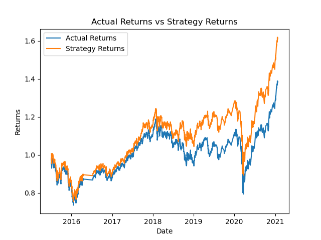

# Algorithmic Trading Demo

    In this demo we are developing an algorithmic training model using sklearn's SVC classifier and AdaBoost. We then fine tune the SVC classifier model to test the resulting strategies using varying SMA short windows and training periods which ultimately are assessed based on backtesting performance.
## SVC Classifier Model 1
SMA short window = 4, training window = 3 months

    
    As a result of our first model, we see that the strategy produced superior returns when compared to the actual returns through the entirety of the backtesting.
## SVC Classifier Model 2
SMA short window = 4, training window = 6 months

#### What impact resulted from increasing or decreasing the training window?

    After adjusting the training window to take in 3 additional months worth to train the model, we actually see the strategy underperforming the previous model throughout the entirety of the backtesting and even underperformed the actual returns significantly during 2019. This is likely an example of overfitting, where the model when presented with additional information, develops false relationships that inhibited it's performance.

## SVC Classifier Model 3
SMA short window = 20, training window = 3 months

#### What impact resulted from increasing or decreasing either or both of the SMA windows?

    After increasing the SMA window from 4 to 20, we see that the strategy's performance followed closely to the actual returns. This is likely because the longer moving average window made the indicator more delayed resulting in the strategies inability to capture short term market sentiment as effectively as the 4 day moving average.
    
## AdaBoost Model
SMA short window = 4, training window = 3 months

#### Did this new model perform better or worse than the provided baseline model? 

    The Adaboost model performed slightly worse when compared to the original SVC classifier model overall. We do see better returns during the beginning of the testing period, but the strategy sees turbulence as it approaches 2019 where it the begins to fall of when compared to the first model.

#### Did this new model perform better or worse than your tuned trading algorithm?

    Although the decrease in performance wasn't as stark as the 2nd and 3rd model, the strategy did see underperformance during the latter half of 2019 when compared to the actual returns. Some may argue that the 2nd adjusted SVC classifier model performed better if they are more risk averse, but ultimately that would be up to a hypothetical portfolio's objectives.
    
## Conclusion

    Overall the original SVC Classifier Model performed the best in regards to returns. SVC classifier model 3 did see reduced volatility compared to the original, but only produced marginal superior returns. If one would want to find a middle ground between the models, then the AdaBoost model ranked comparably in returns to the original model while having reduced volatility. 